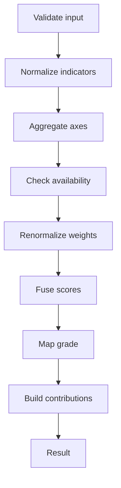
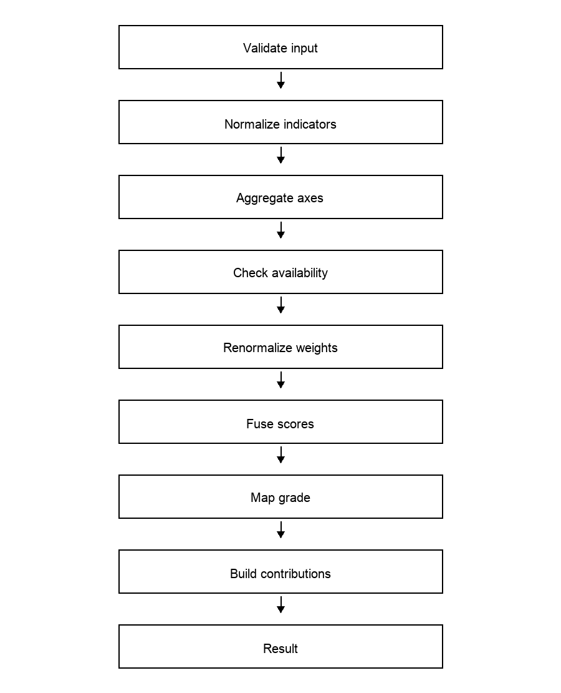

# Triad

[](https://github.com/users/<owner>/packages/container/triad)
[](DEPLOY.md)

Spring Boot service that implements the layered assessment algorithm from `src/2026_EDM-5.pdf`.

## Overview
TRIAD (Traceable Robust Integrated Assessment Decision) exposes a REST API to run a layered assessment pipeline and return both results and trace data.

## End-user deployment
For non-developers, use the prebuilt Docker image and the instructions in `DEPLOY.md`.

## Quickstart
Local run:
```bash
./mvnw spring-boot:run
```

Docker (multi-stage build, recommended):
```bash
docker build -t triad:latest .
docker run -e SPRING_PROFILES_ACTIVE=prod -p 8080:8080 triad:latest
```

Docker (runtime-only, build outside container):
```bash
./mvnw -DskipTests package
docker build -f Dockerfile.runtime -t triad:latest .
docker run -e SPRING_PROFILES_ACTIVE=prod -p 8080:8080 triad:latest
```

Docker Compose:
```bash
docker compose up --build
```

Makefile shortcuts:
```bash
make build
make test
make docker
make docker-run
make docker-runtime
make compose
```

## Deploy
Docker Hub:
```bash
docker build -t triad:latest .
docker tag triad:latest <dockerhub-user>/triad:latest
docker login
docker push <dockerhub-user>/triad:latest
```

GitHub Container Registry (GHCR):
```bash
docker build -t triad:latest .
docker tag triad:latest ghcr.io/<github-user>/triad:latest
echo <ghcr-token> | docker login ghcr.io -u <github-user> --password-stdin
docker push ghcr.io/<github-user>/triad:latest
```

End-user deploy (pull from registry):
```bash
docker compose -f docker-compose.prod.yml up -d
```

## Configuration
Environment variables:
- `SPRING_PROFILES_ACTIVE=prod` (console logging)
- `JAVA_OPTS=-Xms256m -Xmx512m` (JVM tuning)
- `LOG_DIR=/var/log/triad` (only in non-prod)

Logging:
By default (non-prod), logs go to `logs/` and the console. In production (`SPRING_PROFILES_ACTIVE=prod`), logs go only to console (stdout/stderr).

Override the log directory in dev:
```bash
LOG_DIR=/var/log/triad ./mvnw spring-boot:run
```

## API
- `GET /api/health`  
  Returns service health and a server timestamp. Useful for readiness checks and uptime monitoring.
- `POST /api/assessment`  
  Runs the full assessment pipeline on submitted evidence and configuration. Returns the final grade, max grade,
  plus a full assessment trace (normalized evidence, axis scores, effective weights, global score, and main contributors).
- `GET /api/trace/{id}`  
  Retrieves a previously computed assessment trace by `traceId`, if still in memory.
- `GET /api/trace/stats`  
  Returns trace store statistics (count, max size, TTL) for observability.
- `DELETE /api/trace/{id}`  
  Deletes a single trace by id.
- `DELETE /api/trace`  
  Clears all traces from memory.
- `POST /api/trace/purge`  
  Purges expired traces based on TTL and returns how many were removed.
- Swagger UI: `/swagger-ui.html`  
  Interactive OpenAPI documentation with request/response models.

## Schemas and validation
HTTP URLs (served by the app):
- OpenAPI: `http://localhost:8080/openapi/triad.openapi.yaml`
- JSON Schemas: `http://localhost:8080/schema/`
  - e.g. `http://localhost:8080/schema/assessment-request.schema.json`
- Examples: `http://localhost:8080/examples/equivalence/`
  - e.g. `http://localhost:8080/examples/equivalence/eq-valid-full.json`

Local files:
- JSON Schema:
  - `src/main/resources/static/schema/assessment-request.schema.json`
  - `src/main/resources/static/schema/assessment-result.schema.json`
  - `src/main/resources/static/schema/assessment-trace.schema.json`
  - `src/main/resources/static/schema/health-response.schema.json`
  - `src/main/resources/static/schema/trace-stats.schema.json`
  - `src/main/resources/static/schema/trace-purge-response.schema.json`
- OpenAPI: `src/main/resources/static/openapi/triad.openapi.yaml`

### Validate with AJV (Node.js)
```bash
npm i -g ajv-cli
ajv validate -s src/main/resources/static/schema/assessment-request.schema.json -d src/main/resources/static/examples/equivalence/eq-valid-full.json
```

### Validate with Python
```bash
python -m pip install jsonschema
python - <<'PY'
import json
from jsonschema import validate
schema = json.load(open('src/main/resources/static/schema/assessment-request.schema.json'))
instance = json.load(open('src/main/resources/static/examples/equivalence/eq-valid-full.json'))
validate(instance=instance, schema=schema)
print('ok')
PY
```

### Export OpenAPI from a running server
```bash
./mvnw spring-boot:run
./scripts/export-openapi.sh
```
One-shot (start → export → stop):
```bash
./mvnw -q spring-boot:run > /tmp/triad-openapi.log 2>&1 & PID=$!; sleep 2; ./scripts/export-openapi.sh; kill $PID
```
One-shot (Windows PowerShell):
```powershell
$p = Start-Process -FilePath .\\mvnw.cmd -ArgumentList 'spring-boot:run' -PassThru -NoNewWindow
Start-Sleep -Seconds 2
./scripts/export-openapi.sh
Stop-Process -Id $p.Id
```
Stop the server after export (example):
```bash
pkill -f spring-boot:run
```

### Export JSON Schemas from OpenAPI (generated output)
```bash
./mvnw spring-boot:run
./scripts/export-json-schema.py
```
One-shot (start → export → stop):
```bash
./mvnw -q spring-boot:run > /tmp/triad-schema.log 2>&1 & PID=$!; sleep 2; ./scripts/export-json-schema.py; kill $PID
```
One-shot (Windows PowerShell):
```powershell
$p = Start-Process -FilePath .\\mvnw.cmd -ArgumentList 'spring-boot:run' -PassThru -NoNewWindow
Start-Sleep -Seconds 2
./scripts/export-json-schema.py
Stop-Process -Id $p.Id
```
Output goes to `src/main/resources/static/schema/generated/`.
Stop the server after export (example):
```bash
pkill -f spring-boot:run
```

## JSON Examples (functional equivalence classes)
Location: `src/main/resources/static/examples/equivalence/`

Valid:
- `eq-valid-full.json`
- `eq-valid-product-only.json`
- `eq-valid-process-only.json`
- `eq-valid-semantic-only.json`
- `eq-valid-product-process.json`
- `eq-valid-product-semantic.json`
- `eq-valid-process-semantic.json`
- `eq-valid-boundary-values.json`
- `eq-valid-axis-weight-zero.json`
- `eq-valid-axis-weight-not-normalized.json`
- `eq-valid-cost-direction.json`
- `eq-valid-critical-low.json`
- `eq-valid-semantic-reliability-edges.json`

Invalid:
- `eq-invalid-missing-evidence.json`
- `eq-invalid-missing-config.json`
- `eq-invalid-bounds.json`
- `eq-invalid-negative-weight.json`
- `eq-invalid-lambda.json`
- `eq-invalid-maxgrade.json`
- `eq-invalid-missing-direction.json`
- `eq-invalid-semantic-reliability.json`
- `eq-invalid-empty-strings.json`
- `eq-invalid-empty-evidence.json`

### Test ↔ Example mapping (functional set)
- `ValidateInputStepTest.throwsWhenEvidenceMissing` → `src/main/resources/static/examples/equivalence/eq-invalid-missing-evidence.json`
- `ValidateInputStepTest.throwsWhenConfigMissing` → `src/main/resources/static/examples/equivalence/eq-invalid-missing-config.json`
- `NormalizeIndicatorsStepTest.setsNormalizedValuesAndEvidence` → `src/main/resources/static/examples/equivalence/eq-valid-full.json`
- `AggregateAxesStepTest.assignsAxisScoresFromOperations` → `src/main/resources/static/examples/equivalence/eq-valid-full.json`
- `CheckAvailabilityStepTest.marksNotEvaluableWhenAllMissing` → `src/main/resources/static/examples/equivalence/eq-invalid-empty-evidence.json`
- `CheckAvailabilityStepTest.marksAvailableAxes` → `src/main/resources/static/examples/equivalence/eq-valid-product-only.json`
- `RenormalizeWeightsStepTest.usesOperationsWhenEvaluable` → `src/main/resources/static/examples/equivalence/eq-valid-product-only.json`
- `RenormalizeWeightsStepTest.setsNullWeightsWhenNotEvaluable` → `src/main/resources/static/examples/equivalence/eq-invalid-empty-evidence.json`
- `FuseScoresStepTest.usesOperationsWhenEvaluable` → `src/main/resources/static/examples/equivalence/eq-valid-full.json`
- `FuseScoresStepTest.setsZeroWhenNotEvaluable` → `src/main/resources/static/examples/equivalence/eq-invalid-empty-evidence.json`
- `MapGradeStepTest.usesOperationsWhenEvaluable` → `src/main/resources/static/examples/equivalence/eq-valid-full.json`
- `MapGradeStepTest.setsZeroWhenNotEvaluable` → `src/main/resources/static/examples/equivalence/eq-invalid-empty-evidence.json`
- `BuildContributionsStepTest.usesOperationsWhenEvaluable` → `src/main/resources/static/examples/equivalence/eq-valid-full.json`
- `BuildContributionsStepTest.returnsEmptyWhenNotEvaluable` → `src/main/resources/static/examples/equivalence/eq-invalid-empty-evidence.json`
- `BuildResultStepTest.buildsAssessmentResult` → `src/main/resources/static/examples/equivalence/eq-valid-full.json`
- `AssessmentServiceTest.computesExampleFromDocument` → `src/main/resources/static/examples/equivalence/eq-valid-full.json`

## Assessment Pipeline



