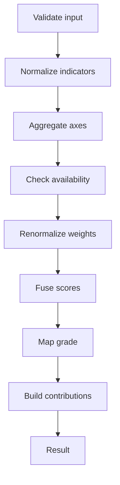

# A Layered and Explainable Assessment Algorithm - Notes

Source: `src/2026_EDM-5.pdf` (20 pages)

## Document structure (Layers)
- Layer A: conceptual requirements, scope, and assumptions.
- Layer B: formal model of the algorithm (main contribution).
- Layer C: implementation and integration aspects.

## 1. Scope and assumptions
- Deterministic algorithm to evaluate complex artifacts produced by students.
- Input: structured evidence only (no raw text or logs).
- No semantic inference or learning.
- Output: discrete numeric grade + explainable trace.

## 2. Canonical evidence model
- Total evidence: `E = {EP, ER, ES}` (each may be missing).
- EP (Product): indicators with observed value, direction (benefit/cost), bounds, weight, critical flag.
- ER (Process): signals with type, severity, frequency, optional persistence, weight.
- ES (Semantic): issues with category, severity, weight; optional reliability.

## 3. Pedagogical configuration
- Configuration `theta` contains axis weights, bounds, severity scales, penalty parameters, grade scale (M).
- Algorithm logic does not change; only `theta` changes.

## 4. Assessment axes
- Product Quality (PQ)
- Process Quality (PrQ)
- Semantic Alignment (SA)
- Each axis produces a score in [0,1].

## 5. Algorithm overview
- Function: `A(EP, ER, ES, theta) -> (G, B)`
- Steps: extract indicators, normalize, aggregate per axis, handle available axes, fuse, map grade, trace.

### Pipeline diagram

Image generated: `docs/assessment-pipeline.png`

## 6. Normalization
- Elemental indicator: `i = <id, v, d, [l,u], w, kappa>`.
- Clipping: `clip(x) = min(1, max(0, x))`.
- Min-max: `n(i) = clip((v - l) / (u - l))`.
- Direction:
  - benefit: `v_hat = n(i)`
  - cost: `v_hat = 1 - n(i)`
- Output: `i_hat = <id, v_hat, w, kappa>`.
- Missing indicators: omitted, no imputation.

## 7. Missing evidence and axis availability
- Axis available if `I_hat_a != empty`.
- `A* = {a in A | I_hat_a != empty}`.
- If `A*` is empty: `NotEvaluable` (grade 0) + diagnostic trace.
- Weight renormalization: `w'_a = w_a / sum_{b in A*} w_b`.

## 8. Product Quality (PQ)
- Base: `PQ_base = sum(w_k * v_hat_k) / sum(w_k)`.
- Critical indicators: `C = {k | kappa_k = 1}`.
- Critical penalties: `p_k = 1 - v_hat_k`.
- Critical factor:
  - if `C` is empty: `P_crit = 1`
  - otherwise: `P_crit = prod_{k in C} (1 - p_k)` (equivalent to prod v_hat_k for criticals)
- Final score: `PQ = PQ_base * P_crit`.

## 9. Process Quality (PrQ)
- Cumulative penalty: `C_PrQ = sum(w_j * s_hat_j)`.
- Saturating transform: `PrQ = exp(-lambda * C_PrQ)`.
- Penalties are always negative; saturation prevents excessive impact for many minor violations.

## 10. Semantic Alignment (SA)
- Reliability: `rho = <rho_cov, rho_conf>`, default 1.
- Factor: `R = rho_cov * rho_conf`.
- Mean semantic penalty: `CSA = sum(w_k * q_hat_k) / sum(w_k)`.
- Adjusted penalty: `C_tilde_SA = R * CSA`.
- Score: `SA = 1 - C_tilde_SA`.

## 11. Score fusion and grade
- Global score: `S_global = sum_{a in A*} w'_a * S_a`.
- Discrete grade: `G = round(M * S_global)` (optional clipping in [0,M]).
- Trace `B` includes: axis scores, effective weights, S_global, grade.

## 12. Contribution trace (explainability)
- Indicator contribution: `Delta(i) = w'_a * delta_a(i)`.
- PQ (per i_hat_k):
  - if not critical: `delta_PQ = (w_k * v_hat_k) / sum w_j`
  - if critical: `delta_PQ = (w_k * v_hat_k) / sum w_j - (1 - v_hat_k)`
- PrQ: `delta_PrQ(r_hat_j) = -lambda * w_j * s_hat_j`
- SA: delta formula not reported in the extracted text (verify in the original PDF if needed).

## 13. Properties and guarantees
- Determinism and reproducibility.
- Boundedness in [0,1] with clipping.
- Monotonicity with respect to indicators.
- Explainability by construction (immutable trace).
- Auditability (ex-post reconstruction of each value).
- Robustness to incomplete evidence (weight renormalization).
- No dependence on cohorts (no relative ranking).
- Domain invariance (structured evidence only).
- Separation between extraction, scoring, explanation.
- Pedagogical control entirely in `theta`.

## 14. Numeric example (summary)
- Example data: PQ with one critical indicator, PrQ with moderate penalty, SA with an issue at severity 0.5.
- Results: `PQ = 0.432`, `PrQ = ~0.741`, `SA = 0.5`.
- `S_global ~ 0.545`, with `M = 30` -> `G = 16`.

## 15. Discussion and limits
- Depends on the quality of structured evidence.
- No autonomous semantic validation.
- Simple and monotone functions (pro: transparency; con: less expressivity).
- Configurability vs objectivity: explicit but normative criteria.

## 16. Explainability and role
- Explanations generated only from trace `B` (do not affect the grade).
- Algorithm as decision support for the instructor, not a replacement.

## 17. Future directions (from the text)
- Derive `theta` from rubrics.
- Richer models for semantic reliability.
- Empirical studies on alignment with human evaluations.
- Tooling to visualize/modify the trace.
