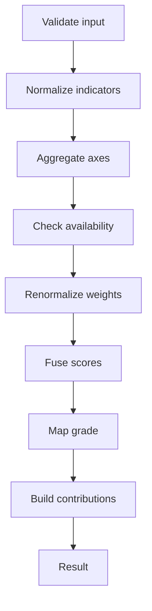

# A Layered and Explainable Assessment Algorithm - Appunti

Source: `src/2026_EDM-5.pdf` (20 pagine)

## Struttura del documento (Layer)
- Layer A: requisiti concettuali, ambito e assunzioni.
- Layer B: modello formale dell'algoritmo (contributo principale).
- Layer C: aspetti di implementazione e integrazione.

## 1. Scope e assunzioni
- Algoritmo deterministico per valutare artefatti complessi prodotti da studenti.
- Input: solo evidenze strutturate (nessun testo grezzo o log).
- Nessuna inferenza semantica o apprendimento.
- Output: voto numerico discreto + trace spiegabile.

## 2. Modello canonico delle evidenze
- Evidenza totale: `E = {EP, ER, ES}` (ognuna puo' mancare).
- EP (Product): indicatori con valore osservato, direzione (benefit/cost), bounds, peso, flag critico.
- ER (Process): segnali con tipo, severita', frequenza, persistenza opzionale, peso.
- ES (Semantic): issue con categoria, severita', peso; reliability opzionale.

## 3. Configurazione pedagogica
- Configurazione `theta` contiene pesi per assi, bounds, scale di severita', parametri di penalty, scala voti (M).
- La logica dell'algoritmo non cambia, cambia solo `theta`.

## 4. Assi di valutazione
- Product Quality (PQ)
- Process Quality (PrQ)
- Semantic Alignment (SA)
- Ogni asse produce score in [0,1].

## 5. Overview algoritmo
- Funzione: `A(EP, ER, ES, theta) -> (G, B)`
- Passi: estrazione indicatori, normalizzazione, aggregazione per asse, gestione assi disponibili, fusione, mapping voto, trace.

### Diagramma pipeline

Immagine generata: `docs/assessment-pipeline.png`

## 6. Normalizzazione
- Indicatore elementare: `i = <id, v, d, [l,u], w, kappa>`.
- Clipping: `clip(x) = min(1, max(0, x))`.
- Min-max: `n(i) = clip((v - l) / (u - l))`.
- Direzione:
  - benefit: `v_hat = n(i)`
  - cost: `v_hat = 1 - n(i)`
- Output: `i_hat = <id, v_hat, w, kappa>`.
- Indicatori mancanti: omessi, nessuna imputazione.

## 7. Evidenza mancante e disponibilita' assi
- Asse disponibile se `I_hat_a != empty`.
- `A* = {a in A | I_hat_a != empty}`.
- Se `A*` vuoto: `NotEvaluable` (voto 0) + trace diagnostico.
- Rinormalizzazione pesi: `w'_a = w_a / sum_{b in A*} w_b`.

## 8. Product Quality (PQ)
- Base: `PQ_base = sum(w_k * v_hat_k) / sum(w_k)`.
- Indicatori critici: `C = {k | kappa_k = 1}`.
- Penalita' critici: `p_k = 1 - v_hat_k`.
- Fattore critico:
  - se `C` vuoto: `P_crit = 1`
  - altrimenti: `P_crit = prod_{k in C} (1 - p_k)` (equivale a prod v_hat_k per i critici)
- Score finale: `PQ = PQ_base * P_crit`.

## 9. Process Quality (PrQ)
- Penalita' cumulativa: `C_PrQ = sum(w_j * s_hat_j)`.
- Trasformazione saturante: `PrQ = exp(-lambda * C_PrQ)`.
- Penalita' sempre negative; saturazione evita eccesso per molte violazioni minori.

## 10. Semantic Alignment (SA)
- Reliability: `rho = <rho_cov, rho_conf>`, default 1.
- Fattore: `R = rho_cov * rho_conf`.
- Penalita' semantica media: `CSA = sum(w_k * q_hat_k) / sum(w_k)`.
- Penalita' aggiustata: `C_tilde_SA = R * CSA`.
- Score: `SA = 1 - C_tilde_SA`.

## 11. Fusione punteggi e voto
- Score globale: `S_global = sum_{a in A*} w'_a * S_a`.
- Voto discreto: `G = round(M * S_global)` (eventuale clipping in [0,M]).
- Trace `B` include: score assi, pesi effettivi, S_global, voto.

## 12. Trace di contributo (explainability)
- Contributo indicatore: `Delta(i) = w'_a * delta_a(i)`.
- PQ (per i_hat_k):
  - se non critico: `delta_PQ = (w_k * v_hat_k) / sum w_j`
  - se critico: `delta_PQ = (w_k * v_hat_k) / sum w_j - (1 - v_hat_k)`
- PrQ: `delta_PrQ(r_hat_j) = -lambda * w_j * s_hat_j`
- SA: formula del delta non riportata nel testo estratto (se serve, va verificata nel PDF originale).

## 13. Proprietà e garanzie
- Determinismo e riproducibilita'.
- Boundedness in [0,1] con clipping.
- Monotonicita' rispetto agli indicatori.
- Explainability by construction (trace immutabile).
- Auditability (ricostruzione ex-post di ogni valore).
- Robustezza a evidenza incompleta (rinormalizzazione pesi).
- Nessuna dipendenza da coorti (no ranking relativo).
- Domain invariance (solo evidenza strutturata).
- Separazione tra estrazione, scoring, spiegazione.
- Controllo pedagogico interamente in `theta`.

## 14. Esempio numerico (riassunto)
- Dati di esempio: PQ con un indicatore critico, PrQ con penalita' moderata, SA con issue a severita' 0.5.
- Risultati: `PQ = 0.432`, `PrQ = ~0.741`, `SA = 0.5`.
- `S_global ~ 0.545`, con `M = 30` -> `G = 16`.

## 15. Discussione e limiti
- Dipende dalla qualita' dell'evidenza strutturata.
- Nessuna validazione semantica autonoma.
- Funzioni semplici e monotone (pro: trasparenza; contro: meno espressivita').
- Configurabilita' vs oggettivita': criteri espliciti ma normativi.

## 16. Explainability e ruolo
- Spiegazioni generate solo dal trace `B` (non influenzano il voto).
- Algoritmo come decision support per il docente, non sostituzione.

## 17. Future directions (dal testo)
- Derivare `theta` da rubriche.
- Modelli piu' ricchi per affidabilita' semantica.
- Studi empirici su allineamento con valutazioni umane.
- Tooling per visualizzare/modificare il trace.
